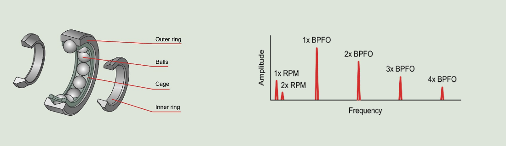
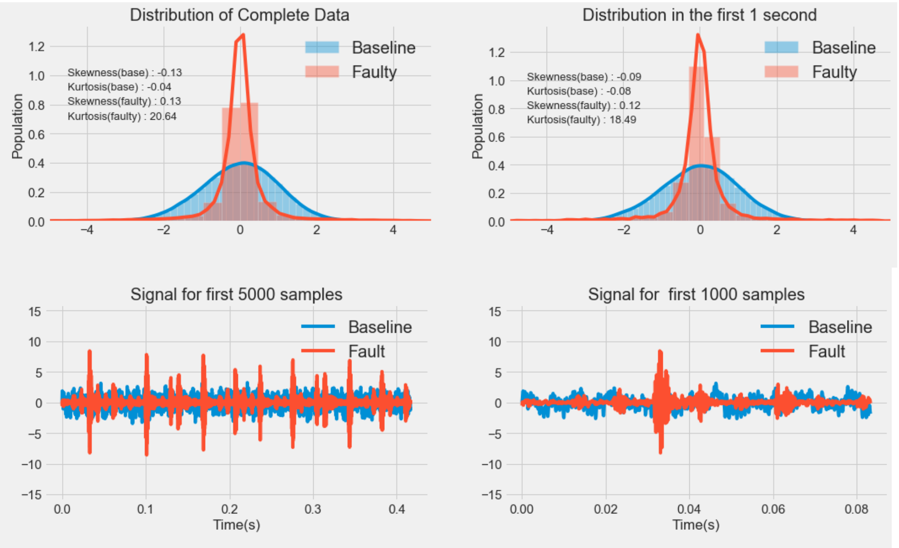
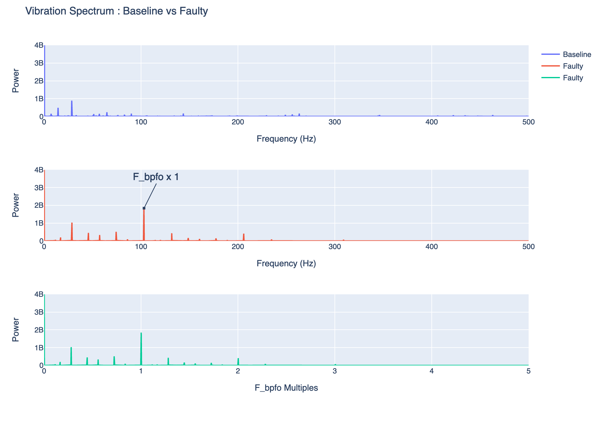
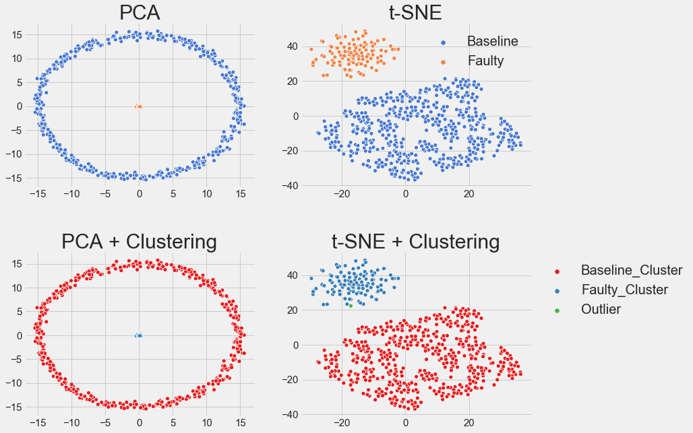
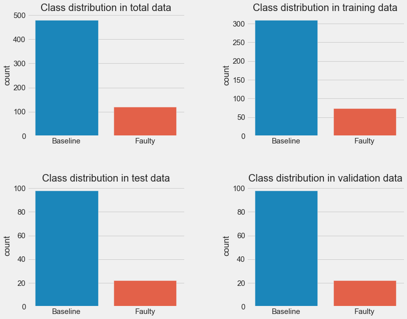
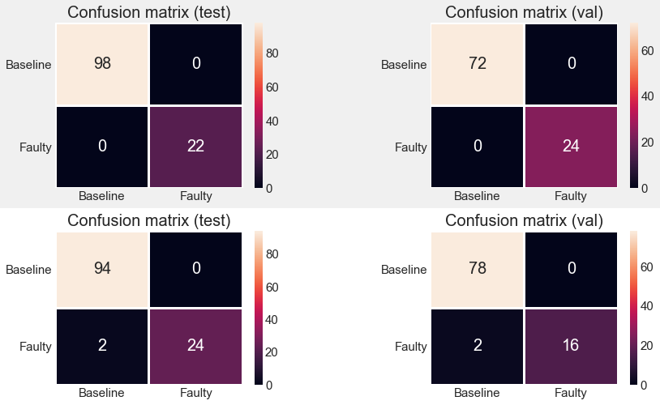

# Conditions Monitoring of Wind Turbines using Machine Learning and Data Analysis 

Ball bearings are a crucial component in any wind turbine. The condition of the ball bearings is monitored to ensure no unexpected downtime of the turbine.

 The ball bearings consists of an outer ring, balls, cage and the inner ring. The ball bearing can be damaged in several ways, where the most common is a dent in either the inner or the outer ring.

Such a dent will cause distinct failure frequencies to appear as a function of the rotation speed of the shaft inside the ball bearing. The **&quot;Ball Pass Frequency Outer&quot;**(BPFO) is the frequencies which the balls passes over a single dent in the outer ring, this is typically specified as a multiple of rotation speed by the manufacturer.
 Every time the ball passes over a dent, it will cause a spike in vibration captured by the data acquisition equipment. This will cause harmonics of the fault frequency(BPFO) to appear in the vibration data as seen in Figure 2. Sometimes these harmonics will also appear at much higher frequencies than seen here, such as and often the low harmonics are not observed.

In this project the Case Western Reserve University Ball bearings dataset is used. 

## Material

In the Python file &quot;case\_western.py&quot; it is shown how to import two HDF5 files containing vibration data from both a good and a faulty bearing. The data from the good bearing is found in &quot;x\_baseline.h5&quot; where 40 samples of 1 second each are found. The data from the faulty bearing is found in &quot;x\_fault.h5&quot; where 10 samples of 1 second each are found.

## Goals

1. Find the difference between a good bearing and a faulty one? Maybe try to identify the BPFO.
2. Use machine learning techniques to distinguish the good bearing from the faulty one.

## Results 

###Comparision Between Baseline and Faulty Data

### Machine Learning

I used the following unsupervised and supervised machine Learning methods for this project : 

*  **Principal Components Analysis**
*  **t-SNE**
*  **Clustering (OPTICS)**
*  **Support Vector Machine (SVM) + Dimensionality Reduction**
*  **XGBoost + FFT** 
*  **Recurrents neural networks**

Careful data preprocessing and dimensionality reduction leads to a perfect score of `100%` accuracy,f1-macro,precision and recal
l with all the methods above. Methods perform reasonably well on the raw data as well with the accuracy of `96.4%` after the K-f
old cross validation.

PCA and t-SNE both successfully reduced the dimensionality of the data and separate baseline and faulty data into different regions, which can be easily clustered.OPTICS nicely predicts faulty and baselines clusters. Also, detects outliers within data (shown in green). 

There is a clear class imbalance in the data. Faulty data is 4 times lower than baseline data.

* **Perfect score in the confusion matrix and both classes are predicted perfectly after dimensionality reduction  and Machine Learning (top).**

* **Not so perfect score in the confusion matrix and faulty class has been as predicted as baseline in 2,2 occasions in both test and validation data respectively after Machine Learning on Raw data. (bottom)**

## Conclusion 

* The distribution of baseline and faulty data is different in the time domain.
* The distribution remains identical even for 1000 samples.
* Statistically, both of the distributions are not skewed. However, faulty one has a very high kurtosis (more outliers) (i.e. no
t close to gaussian distribution).
* PCA and t-SNE both successfully reduced the dimensionality of the data and separate baseline and faulty data into different regi
ons, which can be easily clustered.OPTICS nicely predicts faulty and baselines clusters. Also, detects outliers within data (sho
wn in green)
* Careful data preprocessing and dimensionality reduction leads to a perfect score of `100%` accuracy,f1-macro,precision and recal
l with all the methods above. Methods perform reasonably well on the raw data as well with the accuracy of `96.4%` after the K-f
old cross validation.

